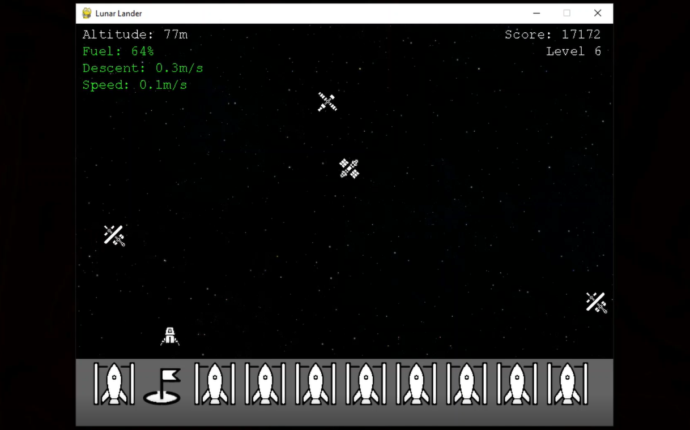

# Lunar Lander

A game where the player avoids obstacles and safely lands on the moon in 10 different levels. Written in Python using Pygame.

Video: <a href="https://youtu.be/ixTvAfbv0Nk">youtube</a>

